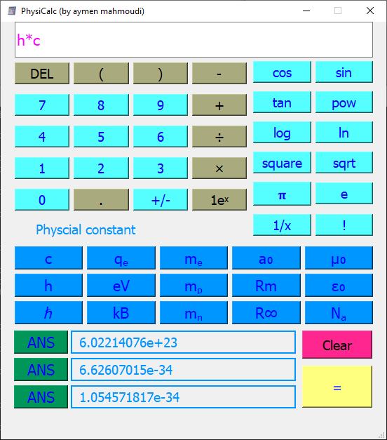

# PhysiCalc — Advanced Scientific Calculator for Physicists


> **A powerful, modern scientific calculator with physics constants.**

---

## Features

| Feature | Description |
|-------|-----------|
| **Physics Constants** | `c`, `h`, `ħ`, `k_B`, `eV`, `N_A`, `μ₀`, `ε₀`, `G`, `m_e`, `m_p`, etc. |
| **Scientific Functions** | `sin`, `cos`, `tan`, `log`, `ln`, `√`, `x²`, `x^y`, `1/x`, `±`, `n!` |
| **History** | Last 3 results (`ans1`, `ans2`, `ans3`) |
| **ANS** | Reuse previous answer |
| **Dark Theme** | Modern flat UI |

---

## Screenshots

<div align="center">
  
</div>

---

## Project Structure

```
PhysiCalc/
│
├── .gitignore
├── LICENSE
├── README.md
├── requirements.txt
├── screenshot_app.png
├── logo.ico
│
├── bin/                
│   └── PhysiCalc.exe            
│
├── src/
│   ├── __init__.py
│   ├── main.py
│   ├── gui.py
│   ├── utils.py
│   └── styles.qss

```

## Support and Contributing
If you encounter any issues, please open an issue on GitHub. For confidential matters, feel free to email me directly. Suggestions and ideas for enhancing the scripts or adding features are warmly appreciated!


